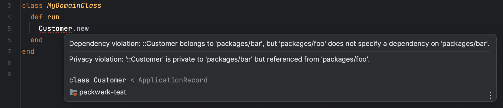

# Packwerk for RubyMine

<!-- Plugin description -->
Runs Packwerk in the background and adds error annotations to Ruby source files.

Note: By default, the linter can only run when the current file is saved to disk. There's an experimental mode
to enable as-you-type linting, but it's not widely supported.
<!-- Plugin description end -->

## Installation

- Using the IDE built-in plugin system:

  <kbd>Settings/Preferences</kbd> > <kbd>Plugins</kbd> > <kbd>Marketplace</kbd> > <kbd>Search for "Packwerk"</kbd> >
  <kbd>Install</kbd>

- Manually:

  Download the [latest release](https://github.com/vinted/packwerk-intellij/releases/latest) and install it manually using
  <kbd>Settings/Preferences</kbd> > <kbd>Plugins</kbd> > <kbd>⚙️</kbd> > <kbd>Install plugin from disk...</kbd>
